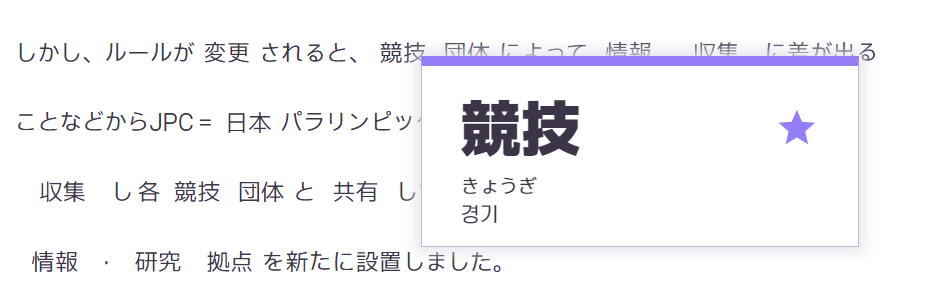
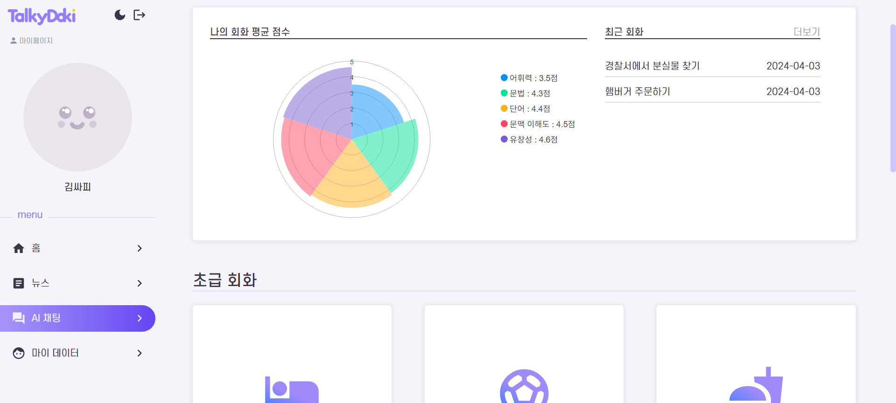
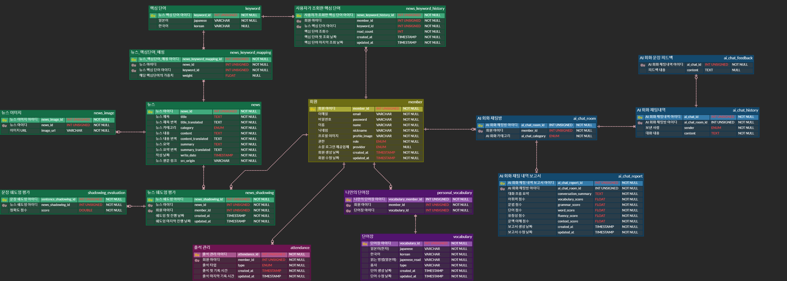
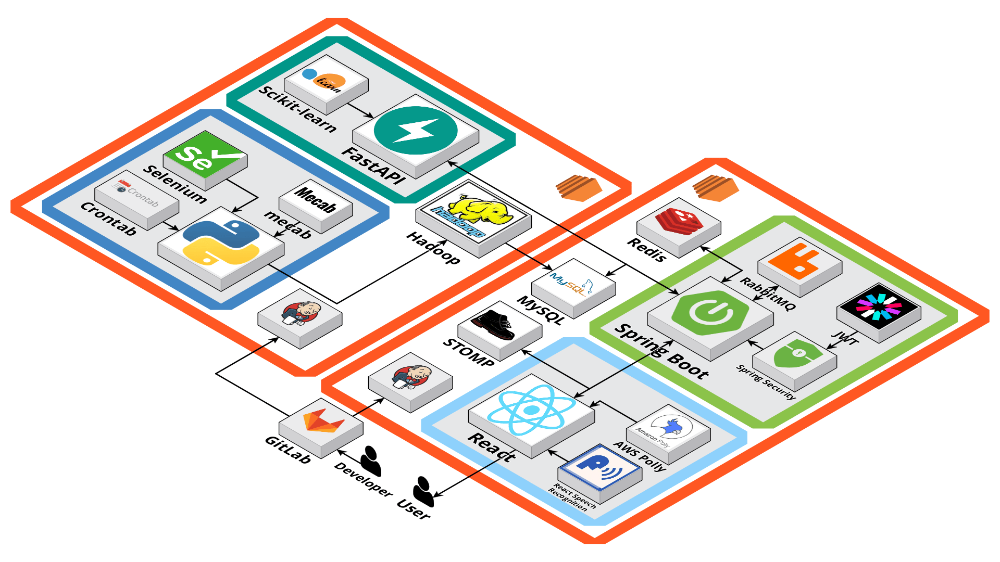

# Talkydoki (빅데이터 분산 프로젝트)

## ✨ 프로젝트 개요

### 1. 프로젝트명

토키도키(Talkydoki)

### 2. 프로젝트 기간

2024.02.26 ~ 2024.04.05(6주)

### 3. 프로젝트 주제

일본어 회화 학습 플랫폼

### 4. 서비스 타겟층

일본어에 대한 기초적인 지식이 있으며, 일본어 읽기와 말하기 실력을 키우고 싶은 사람들

### 5. 프로젝트 주요 기능

#### 👦 회원

- 일반 회원가입
  - 이메일 인증코드를 통한 인증코드 확인 및 이메일 중복 확인 
  - Validation을 이용하여 입력값들에 대한 유효성 검사 기능
- 로그인 / 로그아웃
  - Spring Security + JWT를 통한 토큰을 통한 세션 관리 기능
  - 액세스 토큰 만료시 리프레쉬 토큰을 이용한 토큰 재발급 기능
- 회원정보 변경
  - 닉네임 수정 및 Firebase Storage를 이용한 프로필 이미지 변경 기능
  - 일반 회원인 경우 비밀번호 변경 기능
- 소셜 로그인
  - 네이버, 카카오, 구글을 통한 사용자의 쉬운 소셜 로그인 제공
- 회원 탈퇴
  - 일반 회원가입 한 유저, 소셜 로그인을 통한 유저 회원 탈퇴 기능 제공

#### 📰 뉴스

- 오늘의 뉴스
  - 사용자의 학습 데이터를 바탕으로 개인에게 맞춤화된 뉴스를 추천
  - 신규 가입자나 아직 데이터가 축적되지 않은 사용자의 경우, 다른 사용자들에게 추천이 많이 된 뉴스를 추천
- 뉴스 조회
  - 다양한 카테고리별 최신 순으로 뉴스 목록 제공
  - QueryDSL을 활용한 무한 스크롤 방식(no OffSet 이용)의 뉴스 목록 조회 기능
  - 뉴스 조회 시 TTS를 통해 뉴스 컨텐츠 듣기
  - 뉴스 내 중요 단어 표시 기능을 통한 단어 학습 기능
  - 뉴스 내 단어 검색 기능 및 나만의 단어장으로의 추가 기능
- 뉴스 쉐도잉
  - 뉴스 조회 시 읽기 모드와 학습 모드 선택
  - 학습 모드 시 뉴스 문장의 발음을 듣고 따라 하면서 쉐도잉을 연습
  - 사용자의 발음 정확도 평가
  - 사용자의 녹음과 원어민 발음을 비교하면서 듣기 기능

#### 💬 AI 회화 연습

- 테마 별 회화
  - 일상 생활에서 마주칠 수 있는 다양한 상황(햄버거 주문, 취미 대화, 호텔 체크인 등)을 테마로 선택하여 AI와 실전 회화 연습
- 모범 답안 제공
  - 사용자가 상황에 맞는 자연스러운 대화를 할 수 있도록, AI 튜터가 사용자에게 모범 답안 제공
- 회화 리포트
  - AI와 회화 연습 후, 회화 내용의 요약본과 함께 사용자의 회화 실력을 평가한 리포트를 제공하여 학습 효과를 극대화

#### 📝 사용자 분석

- 나의 학습 진도
  - 매일 학습 진행량에 따라 색이 변화하는 잔디 표시 기능을 통해 사용자에게 학습 진도에 대한 명확한 시각화와 성취감을 제공
- 쉐도잉 점수 비교
  - 사용자가 매일 기록한 쉐도잉 평균 점수와 다른 사용자들의 평균 점수를 비교해 보여주는 그래프를 통해, 자신의 실력을 객관적으로 확인하고 동기 부여 제공
- 나의 단어장
  - 학습 중 사용자가 모르는 단어를 나만의 단어장에 저장하고, 언제든지 확인하여 학습할 수 있는 기능 제공

#### ✔️ 출석 체크

  - 뉴스 쉐도잉 및 AI 회화 연습을 통한 출석 체크 기능 제공
  - 출석 횟수를 통한 브론즈, 실버, 골드, 플래티넘 등 다양한 뱃지 시스템 제공

## ✏️ 기술 특이점

### 뉴스 데이터 크롤링

- selenium 파이썬 라이브러리를 활용하여 NHK 사이트의 8개의 카테고리 뉴스 목록을 크롤링
- googletrans 파이썬 라이브러리를 활용하여 일본어 번역
- Mecab 파이썬 라이브러리를 활용하여 형태소 분리

### 자연어 처리(NLP)

- 자연어 처리 기술을 활용하여 일본어 뉴스 데이터 형태소 분석 및 처리 진행
- 형태소 데이터를 이용한 일->일, 일->한 발음 정보 제공 및 단어 검색 기능 제공

### 빅데이터 분산

- Hadoop을 통한 뉴스 데이터 분산 처리
  - 뉴스 크롤링 후, AWS EC2 서버에서 Hadoop Streaming을 사용하여 뉴스 데이터 내 단어의 TF-IDF 값 계산
  - 기사 내 단어에 대한 WordCount 계산 후 그에 기반하여 TF-IDF 값을 도출하는 MapReduce 과정 수행
  - 각 기사에서 TF-IDF 값이 높은 상위 5개의 단어를 선별하여 뉴스를 조회할 때 중요 단어 표시 기능 제공

### 빅데이터 추천

- Content-Based Filtering Algorithm
  - 사용자의 선호도를 반영하여 선호하는 카테고리의 단어에 대해 더 많은 학습을 진행하는 사용자 더미 데이터 300개 생성
  - 사용자가 학습한 단어 횟수 데이터와 뉴스 - 단어의 TF-IDF 데이터를 이용하여 Cosine Similartiy 계산
  - Cosine Similarity를 기준으로, 사용자와 가장 관련성이 높은 상위 3개의 뉴스 추천
  - 신규 사용자나 데이터가 없는 사용자를 위해, 다른 사용자들에게 가장 많이 추천된 상위 3개의 뉴스를 추천하는 대체 알고리즘 구현을 통해 Content-Based Filtering Algorithm의 단점인 Cold-Start 문제 해결

### TTS / STT

- Amazon Polly TTS(Text-to-Speech)를 통해 사용자가 뉴스를 들을 수 있는 기능 제공
- React-Speech-Recognition을 통해 STT(Speech-to-Text)를 구현하여 사용자의 음성을 텍스트로 변환 후 쉐도잉 평가 기능과 AI와의 회화 기능 제공

### 뉴스 쉐도잉 평가

- 레벤슈타인 거리 알고리즘(Levenshtein Distance)
  - 문자열의 유사도를 검사하는 알고리즘인 레벤슈타인 거리 알고리즘을 활용하여 사용자 녹음 Text와 뉴스 원문을 비교하여 유사도 계산

### OpenAI API
- OpenAI의 GPT-3.5 turbo 모델을 활용하여 고도화된 AI 채팅 회화봇 구현
- 대화 내용 캐싱 및 대화 문맥 이어지게끔 처리
  - AI 채팅 회화봇과 주고받는 대화를 문맥을 유지할 수 있게끔 실시간으로 대화를 Redis에 저장 및 캐싱
  - 대화 세션을 관리함으로써, OpenAI API로 전송되기 전 이전 대화내용을 포함 및 이에 기반한 응답 생성
  - AI가 대화 내용을 기억하여 더 자연스러운 대화가 가능하도록 만듬
  - GPT-3.5 turbo의 응답 형식을 프롬프트 엔지니어링으로 고정하여 객체 데이터를 생성하고 이를 파싱하여 활용
- WebFlux, WebClient를 이용한 API 비동기 처리
  - OpenAI API와의 통신 시 WebFlux의 WebClient를 사용하여 비동기 요청을 수행하여 응답 속도를 향상시키고, 시스템의 리소스 사용을 최적화

### Spirng security + JWT 기술
- Spring security + JWT을 활용하여 로그인한 사용자의 인증 및 사용자의 요청이 서버에 도달할 때마다 검증되어 해당 요청이 유효한 사용자로부터 온 것임을 보증 
- 모든 인바운드 요청에 대해 Security JwtAuthenticationFilter를 통해 JWT가 유효한지 검사, 유효한 경우 사용자의 인증 정보를 SecurityContext에 저장
- 사용자의 인증 정보를 통해 API 접근 권한 부여 

### WebSocket with STOMP & RabbitMQ

- WebSocket 연결을 통해 서버와 클라이언트 간의 지속적이고 실시간의 양방향 통신 채널을 구축하였으며, STOMP 프로토콜을 사용하여 이러한 통신을 구조화하고 메시지 교환을 명확하게 관리
- RabbitMQ 메시지 브로커를 도입하여 메시지를 효율적으로 라우팅하고 분산 처리함으로써, 시스템 전반의 메시지 전달 유연성과 확장성을 향상

### Spring WebFlux

- Spring WebFlux 라이브러리의 WebClient, Mono, Flux 를 사용하여 반응형으로 프로그래밍
- 비동기적이고 비차단적(non-blocking) I/O를 사용하여 스레드 차단을 방지하고 높은 동시성을 지원
- 비차단 I/O로 인해 더 적은 리소스를 사용하여 더 많은 요청을 동시에 처리
- 요청이 I/O를 기다리면서 차단되지 않으므로 로드가 심한 경우에도 애플리케이션의 응답성을 높임

## ✨ 서비스 화면

### 인트로화면

- 사이트 기능 소개
- 반응형 및 다크모드 지원 (전체 페이지에서 동일하게 지원)

### 메인화면

- 오늘의 뉴스

  - 사용자 활동 데이터를 기반으로 사용자의 취향에 맞는 뉴스 3개 추천
  - 신규 가입 등으로 사용자 활동 데이터가 없을 시 다른 사용자들에게 가장 많이 추천된 상위 뉴스 3개 추천
  - 10초에 한 번씩 carousel 다음 페이지로 이동

- 오늘의 회화

  - 9개의 회화 카테고리중 랜덤한 3가지 카테고리 출력

- 사용자 키워드

  - 사용자 활동 데이터를 기반으로 사용자가 자주 조회한 카테고리 상위 10개 출력

- 오늘의 단어
  - DB에 있는 단어중 1가지 랜덤하게 출력
  - 나만의 단어장에 추가/제거 기능 지원

### 뉴스 리스트

- Infinite Scroll을 활용한 전체/카테고리별 뉴스 조회
- 한글 번역 On/Off 기능 제공
- 썸네일 위에서 마우스를 좌우로 이동하여 뉴스 이미지 미리보기 가능

### 뉴스 디테일: 읽기모드

- 뉴스 기사 상세 내용 조회

- 우측 Side Bar

  - 해당 뉴스의 빈출 단어 5개와 해당 단어가 사용된 반도를 중요도 순으로 제공
  - TTS기능의 재생 속도 조절 기능 제공 (0.5배속, 0.7배속, 1배속, 1.5배속)
  - 학습 모드로 전환 가능

- 뉴스 본문
  - 번역, 일->일 발음 및 일->한 발음 On/Off 기능
  - 전체 뉴스 TTS 재생 기능 제공
  - 뉴스 본문에서 사용된 단어 클릭 시 해당 단어를 단어장에서 검색하여 데이터가 있을 경우 읽는 방법, 뜻과 함께 나의 단어장에 추가하는 기능 제공
  - 데이터가 없을 경우 원본 단어와 읽는 방법(일어) 제공

### 뉴스 디테일: 학습 모드

- 뉴스를 문장 단위로 학습 할 수 있으며, 문장 단위의 TTS를 제공
- 문장에 마우스를 hover (모바일은 클릭)하여 각 단어의 발음 확인 가능
- STT 기능을 통하여 사용자가 해당 문장을 읽으면 원본 문장과의 유사도를 측정
- 사용자가 읽은 문장을 녹음하여 다시 듣기 기능 제공

### AI 채팅: 카테고리 리스트

- 나의 회화 통계

  - 여태까지 진행한 회화의 평균 점수 제공
  - 최근 진행한 회화 5개 바로가기 제공
  - 더보기 버튼을 눌러 회화 라포트 조회 페이지로 이동 가능

- 일본어 AI 채팅 리스트
  - 대화 주제의 난이도에 따라 총 9개의 카테고리 (호텔 체크인, 스포츠, 햄버거 주문, 미용실, 병원, 경찰서, 사회적 토론, 동료와 잡담, 식사 예약) 제공

### AI 채팅: 채팅

- 유저가 선택한 카테고리로 AI 챗봇과 대화하는 기능 제공
- 카테고리에 따른 대화이나 디테일은 매 대화마다 다르게 제공됨
- 챗봇 번역과 유저 Tip을 제공하며, 해당 기능을 On/Off 가능
- 챗봇 대사 및 유저 Tip TTS 기능 제공
- STT 기능을 통하여 유저의 대답을 채팅방에 입력 후 전송
- 대화 내용을 바탕으로 대화 분석 및 리포트 작성 기능 제공

### AI 채팅: 채팅 리포트

- AI와 대화한 내역을 어휘력, 문법, 단어, 문맥 이해도, 유창성의 5가지 평가 항목으로 나누어 채점
- 대화 내용 요약본 제공
- 채팅 내용을 되돌아보며 각 발언에 대한 Feedback을 받을 수 있으며, 해당 기능 On/Off 가능
- 작성된 리포트를 저장하여 다시보기 기능 제공

### 마이데이터

- 유저 활동 기록

  - 여태까지 진행한 쉐도잉과 AI 채팅 (리포트 작성) 횟수 통계를 조회할 수 있으며, 횟수가 오를 수록 유저 티어 상승
  - heatmap 형식의 달력을 이용하여 특정일 몇 번의 학습을 진행하였는지 조회 가능
  - 사용자의 뉴스 쉐도잉 평균 점수와 전체 유저의 쉐도잉 평균 점수를 그래프 형식으로 제공하여, 현재 사용자의 위치를 파악할 수 있음
  - 나의 단어장 미리보기 기능을 제공하여 단어장에 추가된 5개의 단어 미리보기 가능

- 나의 단어장

  - 유저가 단어장에 추가한 단어 모아보기 및 삭제 기능 제공
  - 단어 뜻/발음 On/Off 기능 제공

- 나의 리포트
  - 여태까지 유저가 진행한 AI 채팅 목록 표시

### 소셜로그인

- 네이버, 카카오, 구글 아이디로 소셜 로그인 기능 제공

### 회원가입 및 로그인

### 프로필수정

### 회원탈퇴

## 🚀 기술 스택

### Front-End

- React
- Typescript
- axios
- zustand
- React Query
- MUI
- Styled Components
- React-router-dom
- AWS Polly
- React-speech-recognition
- webStomp-client
- ApexCharts

### Back-End

- Java `17.0.10`
- Spring Boot `3.2.3`
- Lombok
- openAPI `(Swagger 3.0)`
- OAUTH `2.0`
- Gradle `8.5`
- Spring Security
- JWT
- Spring Data JPA
- QueryDSL
- WebFlux
- WebSocket
- STOMP
- RabbitMQ
- Firebase Storage
- Jasypt
- Java Mail Sender
- Flyway
- OpenAI API `(GPT)`
- Python `3.8.10`
- FastAPI `0.110.0`

### DB

- MySQL `8.0.36`
- Redis

### Infra

- AWS EC2
- Ubuntu `20.04.6 LTS`
- Nginx
- Docker `25.0.4`
- Docker Compose
- Jenkins `2.448`

### Data

- selenium `4.19.0`
- Hadoop `3.3.6`
- Crontab
- Mecab
- scikit-learn `1.4.1`
- webdriver-manager `4.0.1`
- googletrans `4.0.0rc1`
- requests `2.31.0`
- paramiko `3.4.0`
- pytz `2024.1`
- unidic-lite
- SQLAlchemy `2.0.28`

## 프로젝트 노션 페이지

[프로젝트 노션 페이지](https://translucent-polish-c76.notion.site/Talkydoki-07e378a00ab54e089874ca28178d3f8d?pvs=4)

## 기능 명세

[기능 명세](https://translucent-polish-c76.notion.site/3754b9a4e4bf49519f1c5eab99fe4415)

## API 명세

[API 명세](https://translucent-polish-c76.notion.site/API-9e9953ecc90f492f9efed251e04c6f49?pvs=4)

## 프로젝트 관련 기술 정리

[프로젝트 관련 기술 정리](https://translucent-polish-c76.notion.site/ee081d7536ee4e91913f2dcd69263a42?v=0096ec74109c4ffda8deb13394ff4e08&pvs=4)

## ERD

## System Architecture

## 역할 분담

| 이름   | 역할               | 업무                                                                       |
| ------ | ------------------ | -------------------------------------------------------------------------- |
| 송강산 | 팀장, BE, FE, Data | CI/CD(젠킨스, 도커), 뉴스 데이터 크롤링 및 형태소 분석, 일본어 문장 번역 등 데이터 전처리 작업, 뉴스 목록 조회, 뉴스 단일 조회, AI 회화 채팅 레포트 분석페이지 제작 |
| 백민정 | FE 리더             | UI/UX 및 기본 컴포넌트 설계, 일본어 관련 처리(일->일, 일->한 발음 및 단어 검색 / 단어장), 메인 페이지, 마이 데이터 페이지, 뉴스(리스트, 읽기 모드, 학습 모드, 쉐도잉), 로그인 / 가입 유효성 관련 처리 |
| 신동근 | BE 리더             | FE, BE 스켈레톤 구조 설계, 단어장 데이터 크롤링, Spring Security + JWT 설정, 회원 도메인, 단어장 도메인, AI 회화 채팅 도메인, 프로퍼티 암호화 설정, DB 마이그레이션 |
| 오기선 | FE                 | AI 회화 채팅 카테고리 작성, AI 회화 채팅 페이지 TTS(AWS Polly) / STT(React Speech API) 구현, 채팅 리스트 작성, STOMP WebSocket 연결, 로그인 / 회원 가입, 소셜 로그인, 로고 디자인, 마이 페이지 |
| 이지호 | BE, Data           | CI/CD(Hadoop Server), 뉴스 데이터 분산 처리, Content-Based Algorithm 기반 뉴스 추천, 일본어 키워드 저장, 사용자 관심 키워드 조회, 뉴스 쉐도잉, 마이 페이지(쉐도잉 현황) 구현 |
| 조현호 | BE                 | AI 회화 채팅 도메인, OpenAI API 설정, AI 회화 채팅 레포트 분석, AI 회화 채팅 피드백, 프롬프트 설정 |
